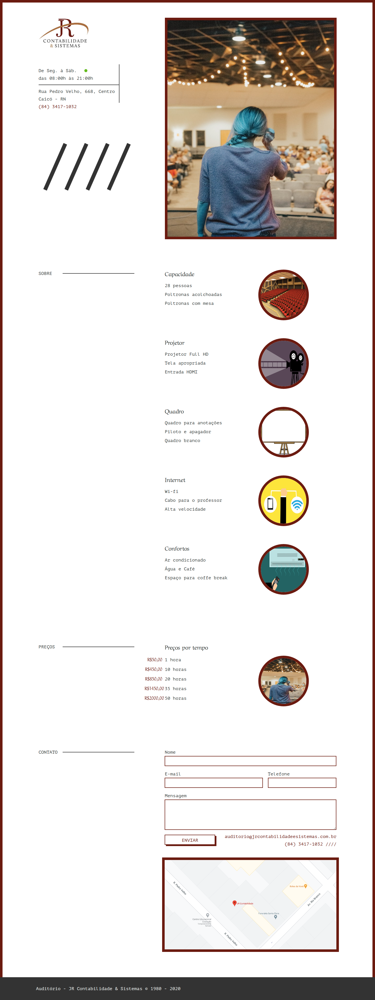
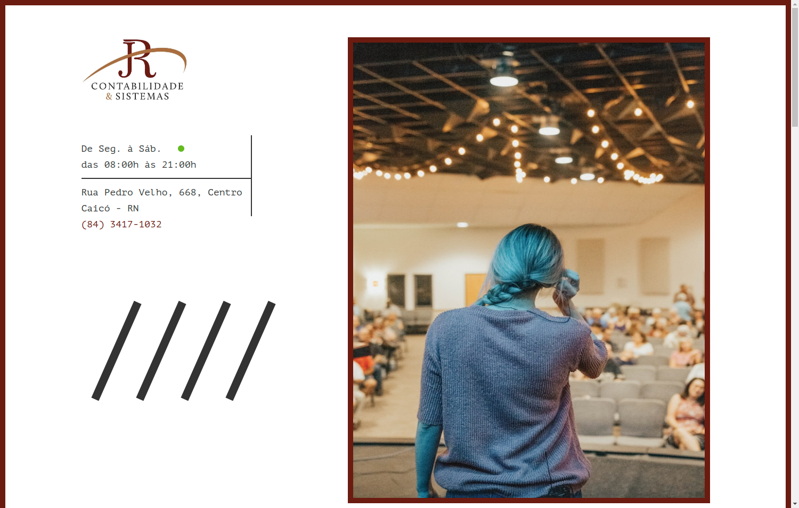

<h1 align="center">
 
Site - JR Contabilidade & Sistemas Auditorium
</h1>

Website design for a company auditorium.

  

  
  

## Technologies

 

## About

Nowadays, services increasingly need to be on the internet to get noticed. One way to show what a company does is through websites. This project aims to show a company's auditorium service.

## Get started

- Clone repository
- Execute index.html file

## License

[LICENSE](https://opensource.org/licenses/MIT)

---

Created with passion by me 👨🏻‍💻
